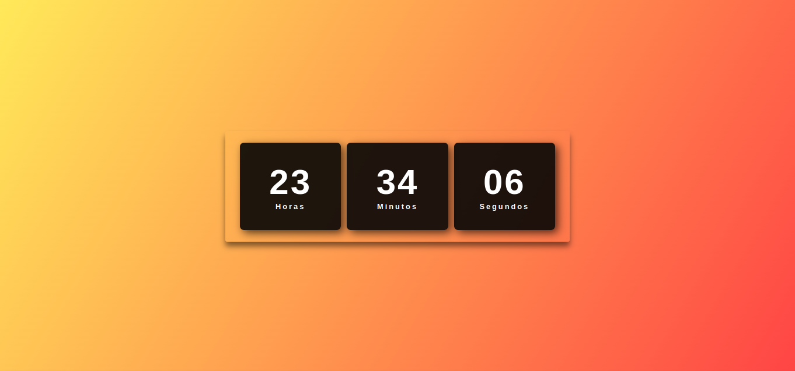

# Relógio Digital

Este projeto é um relógio digital simples e elegante, desenvolvido com HTML, CSS e JavaScript. Ele exibe a hora atual em tempo real, com atualização a cada segundo. O relógio possui um design clean e responsivo, adaptando-se a diferentes tamanhos de tela.

## Funcionalidades
- Exibição da hora atual: O relógio mostra a hora, minutos e segundos no formato HH:MM:SS.
- Atualização em tempo real: A hora é atualizada automaticamente a cada segundo.
- Design responsivo: O relógio se adapta a diferentes dispositivos e tamanhos de tela.

## Demonstração

## Como Usar

1. Clone o repositório para sua máquina local.
2. Abra o arquivo `index.html` em seu navegador.

O relógio será exibido automaticamente e começará a funcionar.

## Personalização

Você pode personalizar o relógio editando o arquivo `style.css`. Altere as cores, fontes e outros estilos para criar sua própria aparência.

## Contribuições

Sinta-se à vontade para contribuir com melhorias, correções de bugs ou novas funcionalidades. Basta fazer um fork do repositório e enviar um pull request.
